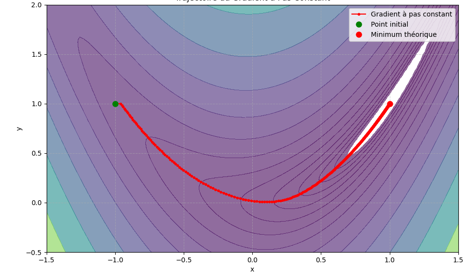
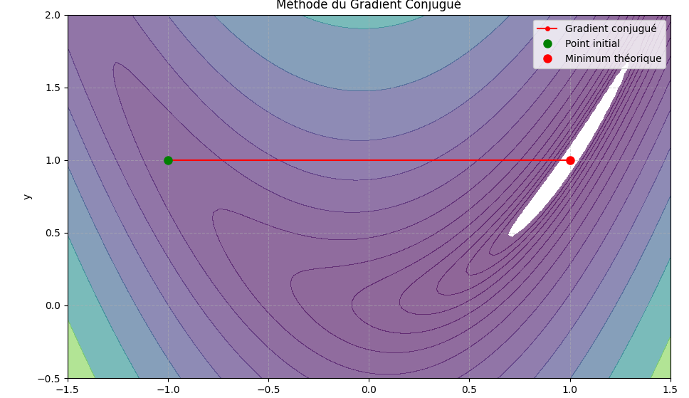
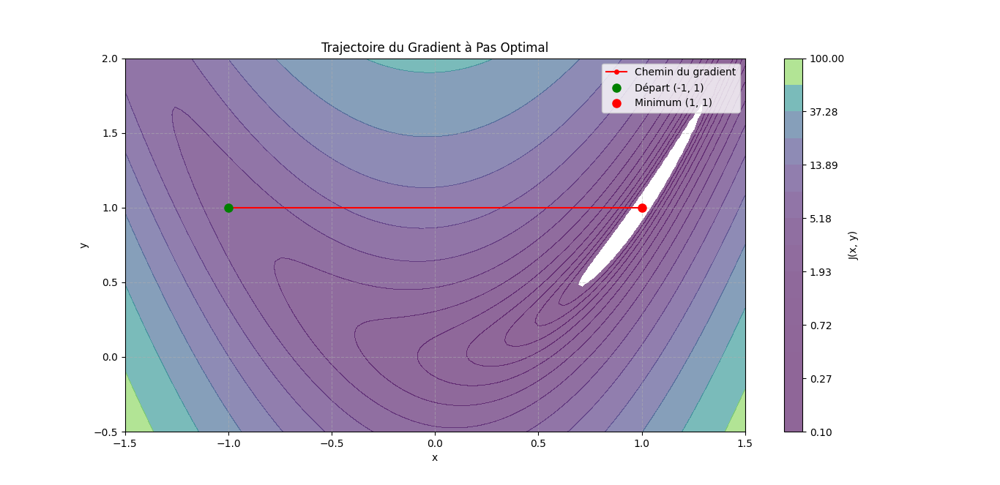
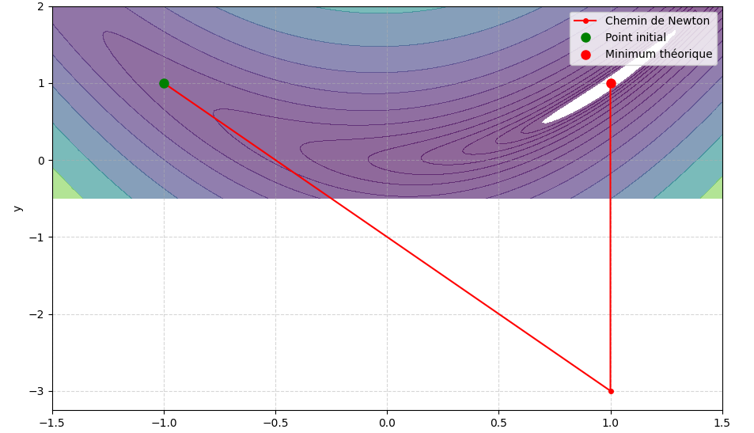

# Comparative Study of Optimization Algorithms

## Description

Ce projet présente une comparaison de plusieurs algorithmes d’optimisation appliqués à une fonction non linéaire de deux variables.

Les méthodes implémentées sont :

- Gradient à pas constant
- Gradient à pas optimal
- Méthode de Newton
- Méthode du gradient conjugué

L’objectif est d’étudier :
- la vitesse de convergence
- le nombre d’itérations
- le comportement des trajectoires
- l’efficacité de chaque méthode

---

## Fonction étudiée

La fonction utilisée dans ce projet est :

$$
J(x,y) = (x - 1)^2 + 10(x^2 - y)^2
$$

Le minimum théorique est atteint au point :

(x, y) = (1, 1)

---

## Technologies utilisées

- Python
- NumPy
- Matplotlib
- SciPy

---

## Structure du projet

```bash
optimization-comparison/
│
├── theory/
│   ├── calcul_du_grad_et_H.png
│   ├── calcul_du_gradient.png
│   ├── convexe_suite.png
│   ├── convexe.png
│   ├── etude_de_la_plage_de_pas_qui_fait_converger_algo.png
│   └── suite_de_etude_de_la_plage_de_pas_qui_fait_converger_algo.png
│
│
├── resultat/
│   ├── gradient_conjugue.png
│   ├── gradient_constant.png
│   ├── gradient_optimal.png
│   └── newton.png
│   
├── src/
│   ├── gradient_pas_cst.py
│   ├── gradient_pas_optimal.py
│   ├── newton.py
│   └── gradient_conjugue.py
│
└── README.md
```

---

## Résultats obtenus

| Méthode | Nombre d’itérations |
|---|---|
| Gradient à pas constant | 1001 |
| Gradient à pas optimal | 2 |
| Méthode de Newton | 3 |
| Gradient conjugué | 2 |

## Visualisations

### Gradient à pas constant



### Gradient conjugue




### Gradient à pas optimal




### Méthode de Newton



---

## Analyse

Les résultats montrent que :

- Le gradient à pas constant converge lentement et dépend fortement du choix du pas.
- Le gradient à pas optimal améliore fortement la vitesse de convergence.
- La méthode de Newton converge très rapidement grâce à l’utilisation de la Hessienne.
- Le gradient conjugué améliore la direction de descente du gradient classique et permet généralement une convergence plus rapide, notamment dans les vallées étroites.
- Dans notre expérience, le phénomène de zigzag du gradient classique reste peu visible à cause du faible pas utilisé (α=0.01). Cependant, la méthode converge beaucoup plus lentement que les autres approches.

---

## Exécution

Installer les bibliothèques nécessaires :

```bash
pip install numpy matplotlib scipy
```

Exécuter un fichier :

```bash
python newton.py
```

---

## Auteur

Projet réalisé dans le cadre des travaux pratiques d’optimisation numérique.

---


## Conclusion

Cette étude montre que les méthodes utilisant des informations supplémentaires
sur la fonction (pas optimal, Hessienne, directions conjuguées)
convergent beaucoup plus rapidement que le gradient à pas constant.

La méthode de Newton est particulièrement efficace grâce à l’utilisation de la Hessienne, mais son coût de calcul peut devenir important pour les problèmes de grande dimension.